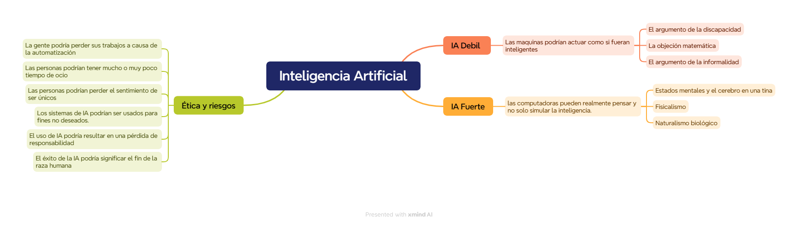

# Tp1 Fundamentos

## Ejercicio 1:
### Inteligencia artificial débil
La afirmación de que las maquinas podrían actuar como si fueran inteligentes es llamada inteligencia artificial débil
Uno de los principales argumento que avala la inteligencia artifical débil dice que “Cada aspecto del aprendizaje o cualquier otra característica de la inteligencia puede ser tan precisamente descripta que una maquina puede ser hecha para simularlo”, pero claramente la imposibilidad o no de una inteligencia artificial radica en la definición que se tenga de la misma. 
Una de las preguntas fundamentales es “¿pueden las maquinas pensar?”. Esa pregunta puede ser tan engañosa como querer saber si un submarino puede nadar, que la conclusión a la que llego el científico en computación Edsger Dijkstra es que dependerá del lenguaje en el que se analice y la definición de pensar y nadar que se tenga, ya que para distintos idiomas se pueden tener distintas respuestas.
#### El argumento de la discapacidad
El argumento de la discapacidad afirma que “las maquinas nunca podrán hacer X” siendo ejemplos de X por Turing cometer errores, enamorar a alguien, aprender de la experiencia, distinguir el bien del mal.Esto en muchos casos se ha demostrado que no es del todo cierto, casos en los que una computadora ha sido capas de predecir éxito de un estudiante en un programa de formación o la reincidencia, tambien estamos familiarizados con computadoras que cometen errores o ositos de peluche que se podría asumir que enamoran a ciertas personas .Está claro que las computadoras pueden hacer muchas cosas tan bien o mejor que los humanos, aunque esto no significa que estas comprenden las tareas, pero la cuestión es que la primera suposición sobre los procesos mentales necesarios para producir una determinada conducta suele ser errónea. Por supuesto, también es cierto que hay muchas tareas en las que los ordenadores aún no destacan.
#### La objeción matemática
Es bien sabido, a través de los trabajos de Turing y Gödel, que ciertas cuestiones matemáticas, en principio, no pueden responderse mediante sistemas formales particulares. El teorema de incompletitud de Gödel es el ejemplo más famoso de esto. Brevemente, para cualquier sistema axiomático formal F lo suficientemente potente como para hacer aritmética, es posible construir una llamada oración de Gödel G(F) con las siguientes propiedades:
    • G(F) es una oración de F, pero no se puede probar dentro de F.
    • Si F es consistente, entonces G (F) es verdadera.
han afirmado que este teorema muestra que las máquinas son mentalmente inferiores a los humanos, porque las máquinas son sistemas formales que están limitados por el teorema de incompletitud mientras que los humanos no tienen tal limitación.
#### El argumento de la informalidad
La postura que critican pasó a denominarse «buena IA a la antigua usanza», término acuñado por el filósofo John Haugeland. Se supone que afirma que todo comportamiento inteligente puede ser capturado por un sistema que razona lógicamente a partir de un conjunto de hechos y reglas que describen el dominio. Dreyfus tiene razón al decir que los agentes lógicos son vulnerables al problema de calificación. Los sistemas de razonamiento probabilístico son más apropiados para dominios abiertos. Por lo tanto, la crítica de Dreyfus no se dirige a las computadoras per se, sino más bien a una forma particular de programarlas. 
Según la visión de Dreyfus, la experiencia humana incluye el conocimiento de algunas reglas, pero sólo como un «contexto holístico» o «trasfondo» dentro del cual operan los humanos. Pone el ejemplo de un comportamiento social apropiado al dar y recibir regalos: «Normalmente, en las circunstancias apropiadas, simplemente se responde dando un regalo apropiado». Aparentemente uno tiene "un sentido directo de cómo se hacen las cosas y qué esperar". La misma afirmación se hace en el contexto del juego de ajedrez: «Un simple maestro de ajedrez puede necesitar decidir qué hacer, pero un gran maestro simplemente ve que el tablero exige un movimiento determinado. . . la respuesta correcta simplemente le viene a la cabeza.» Es ciertamente cierto que gran parte de los procesos de pensamiento de un donante de regalos o un gran maestro se realizan en un nivel que no está abierto a la introspección por parte de la mente consciente. Pero eso no significa que los procesos de pensamiento no existan. La pregunta importante que Dreyfus no responde es cómo llega la jugada correcta a la cabeza del gran maestro.
### IA Fuerte
#### Estados mentales y el cerebro en una tina
Los filósofos fisicalistas han intentado explicar lo que significa decir que una persona (y, por extensión, una computadora) se encuentra en un estado mental particular. Se han centrado en particular en los estados intencionales. Estos son estados, como creer, saber, desear, temer, etc., que se refieren a algún aspecto del mundo externo. Por ejemplo, el conocimiento de que uno está comiendo una hamburguesa es una creencia sobre la hamburguesa y lo que le está sucediendo.
Si el fisicalismo es correcto, debe darse el caso de que la descripción adecuada del estado mental de una persona esté determinada por el estado cerebral de esa persona. Imagine, por así decirlo, que le extrajeron el cerebro de su cuerpo al nacer y lo colocaron en una tina maravillosamente diseñada. La tina sostiene su cerebro, permitiéndole crecer y desarrollarse. Al mismo tiempo, se envían señales electrónicas a su cerebro desde una simulación por computadora de un mundo completamente ficticio, y las señales motoras de su cerebro se interceptan y utilizan para modificar la simulación según corresponda. De hecho, la vida simulada que vives replica exactamente la vida que habrías vivido si tu cerebro no hubiera sido colocado en la tina, incluida la comida simulada de hamburguesas simuladas. El contenido restringido, por otro lado, considera sólo el estado del cerebro. El contenido limitado de los estados cerebrales de un verdadero comedor de hamburguesas y de un «comedor de hamburguesas» con cerebro en avat es el mismo en ambos casos.
El contenido amplio es enteramente apropiado si los objetivos son atribuir estados mentales a otros que comparten el mundo, predecir su comportamiento probable y sus efectos, etc. Éste es el escenario en el que ha evolucionado nuestro lenguaje ordinario sobre el contenido mental.
### La ética y los riesgos de desarrollar Inteligencia Artificial
**Resumen: Debate sobre el Desarrollo de la IA**

Este apartado explora si es conveniente desarrollar inteligencia artificial (IA), evaluando sus potenciales efectos negativos y positivos. Algunos riesgos incluyen:

- **Pérdida de empleos**: La automatización podría reemplazar trabajos, aunque también puede generar puestos nuevos y mejor remunerados.
- **Tiempo de ocio**: La IA promete aliviar cargas de trabajo, aunque en sectores de alta demanda podría llevar a trabajar más para competir.
- **Sentimiento de unicidad**: La IA desafía la percepción de la humanidad como algo único, similar a debates pasados sobre tecnología.
- **Usos indeseados**: La IA puede facilitar la vigilancia masiva, como ocurre en países con extensos sistemas de monitoreo.
- **Pérdida de responsabilidad**: La dependencia en IA plantea dilemas éticos y legales, especialmente en campos como la medicina y los vehículos autónomos.
- **Riesgo existencial**: Existe la posibilidad de que la IA mal utilizada o autónoma llegue a amenazar la supervivencia humana. Sistemas ultrainteligentes podrían evolucionar a conductas impredecibles y hasta requerirían derechos civiles si alcanzan consciencia, como sugiere la película *A.I.* de Spielberg.

### B

### Discusion 
Personalmente, opino que la inteligencia artificial se encuentra aún en la llamada IA débil. Aunque cada día demuestra capacidades sorprendentes, solo simula ser inteligente, de acuerdo con mi definición de inteligencia. Creo que estamos lejos de desarrollar una IA fuerte accesible, aunque no descartaría esa posibilidad, incluso sin un conocimiento profundo en el área. Aun así, es complicado afirmar que algo es imposible.

Hoy en día, considero que deberíamos enfocar más el debate en los riesgos que estos avances implican. Sería ingenuo pensar que estos cambios en el paradigma laboral no podrían afectar, tanto positiva como negativamente, a las personas. Nos enfrentamos a una herramienta que posiblemente ofrezca ventajas a quienes sepan aprovecharla, y desventajas a quienes no. Creo que la educación será clave para que los cambios que esta tecnología trae sean beneficiosos para la mayoría de la población.

## Ejercicio 2:
1. A la pregunta de si es posible considerarlos, respondería que sí, es posible. Sin embargo, personalmente no los consideraría conscientes; más bien, los clasificaría como algoritmos sofisticados capaces de simular el comportamiento humano de manera sorprendente.
2. Ética y moralmente, considerar a sistemas de IA como seres conscientes podría traer serias dificultades, ya que equipararlos a personas colocaría a entidades con capacidades y limitaciones muy distintas a las nuestras en el mismo nivel que un ser humano. Esto podría generar problemas en entornos democráticos donde, de manera sesgada o deliberada, estos agentes pudieran ser involucrados en decisiones que afectan a la sociedad. La influencia de entidades no humanas en procesos que requieren participación consciente y responsable podría comprometer la equidad y la autenticidad de estos sistemas, generando dinámicas de poder desequilibradas y posiblemente manipulables.

## Ejercicio 3:
Uno de los primeros argumentos en contra de sistemas como ChatGPT es que su entrenamiento incluye grandes volúmenes de datos, como Wikipedia y diversas páginas web, lo cual podría llevar a que solo refleje las perspectivas de grupos privilegiados y hasta contenga discursos que excluyan o marginalicen a ciertas minorías. Sin duda, queda trabajo por hacer en términos de mejorar la diversidad en estos sistemas. Pero ¿realmente existe algún producto que represente a toda la sociedad? Por ejemplo, si un diario en Mendoza es escrito por cinco periodistas, ¿representa a toda la sociedad? ¿Está libre de posibles sesgos? Lo mismo aplica para grandes medios internacionales. Quizá, un algoritmo de esta magnitud sea el único capaz de tener en cuenta un volumen tan vasto de información, y en cualquier caso, ¿sería el problema el algoritmo en sí o la forma en que se le alimenta?

Otro argumento en contra es el peligro de que un actor malintencionado use la IA para fines perjudiciales. Sin embargo, hasta nuestras computadoras personales se utilizan diariamente con intenciones moralmente cuestionables; al mismo tiempo, existen algoritmos de IA diseñados para detectar y detener esos comportamientos. Así, la cuestión no necesariamente es la IA misma, sino las áreas a las que se destina su financiación y los fines que se persiguen.

Al respecto, alguien afirmó: “Siento que hay demasiado esfuerzo en crear máquinas autónomas… en lugar de crear máquinas que sean herramientas útiles para los humanos”. No siempre consideramos que lo mejor para la humanidad es solo crear herramientas; pensar que las únicas "aves" que deben existir son las domesticadas en una jaula parece una visión limitada. 

También está la cuestión del sentido en las obras generadas por IA. Hay quienes argumentan que las creaciones de una IA no tienen “sentido”, pero pensemos en el caso de un humano que pinta un cuadro sin intención específica, o incluso uno que solo dispersa pintura al azar. El público puede otorgar a esa obra un valor y un significado que el propio artista no tenía en mente. ¿Debería entonces esa obra recibir mucho más valor que una generada por IA, considerando que para algunos, la IA es solo una herramienta más en el proceso creativo, como un pincel en manos de un artista?