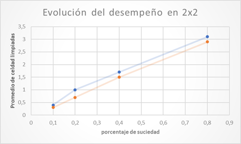

# Comparativa de Rendimiento entre Agentes Reflexivos y Aleatorios

## Introducción
Durante el desarrollo del proyecto, se decidió realizar una comparativa del rendimiento entre dos tipos de agentes: uno reflexivo y otro que ejecutaba sus acciones de manera completamente aleatoria. La tarea asignada a ambos agentes consistía en limpiar la suciedad de las celdas de una matriz.

## Marco Teórico
Los entornos en los que los agentes debían desenvolverse eran matrices de tamaño fijo, compuestas por casillas que indicaban si estaban sucias o limpias. Una vez limpiadas, las casillas no volvían a ensuciarse. Los agentes solo disponían de información sobre el estado de la casilla en la que se encontraban. El agente reflexivo, al no tener memoria y basar sus decisiones únicamente en la información obtenida por sus sensores, se movía en direcciones aleatorias, pero solo limpiaba cuando estaba en una casilla sucia. En cambio, el agente aleatorio realizaba todas sus acciones de manera completamente aleatoria, lo que significaba que podía limpiar casillas ya limpias, sin aportar ningún beneficio.

## Diseño Experimental
Para evaluar el desempeño de los agentes, se utilizó como métrica la cantidad de casillas limpiadas tras 1000 movimientos. Con el objetivo de realizar un análisis exhaustivo y comparativo significativo entre los agentes, se llevaron a cabo evaluaciones en entornos de distintos tamaños y con diferentes porcentajes de suciedad. Los entornos evaluados incluyeron tamaños de: 2 × 2, 4 × 4, 8 × 8, 16 × 16, 32 × 32 y 64 × 64, con porcentajes de suciedad de: 0.1, 0.2, 0.4 y 0.8. Esta variedad permitió obtener una visión más completa del rendimiento de los agentes. Para garantizar la robustez de los resultados, cada agente fue evaluado en 10 pruebas diferentes por cada configuración de entorno y porcentaje de suciedad.

## Análisis y Discusión de los Resultados
En las siguientes gráficas se presentan los promedios de desempeño de las 10 pruebas y su evolución con el incremento en la cantidad de celdas, manteniendo un promedio constante de suciedad.

Se observa claramente que la diferencia en desempeño aumenta con el tamaño de las matrices, siendo el agente reflexivo notablemente superior.
A continuación, se muestra una comparación entre los desempeños de ambos agentes en entornos de 2x2 y 128x128, y cómo evolucionan al incrementar el porcentaje de suciedad.

## Conclusiones
La primera conclusión que se nos viene a la mente podría ser que el agente reflexivo tiene un desempeño superior en todas las pruebas que se realizaron, a comparación del agente aleatorio, y sería una conclusión correcta. Pero si observamos de forma más detallada podríamos pensar que el agente reflexivo es significativamente mejor en entornos de gran tamaño, por lo que en entornos pequeños sería necesario evaluar costos y beneficios para tomar una decisión acertada entre los dos agentes, ya que a pesar de que el agente reflexivo puede tener un mejor desempeño, este puede llegar a ser similar al de un agente aleatorio y merecedor de un costo demasiado superior.
