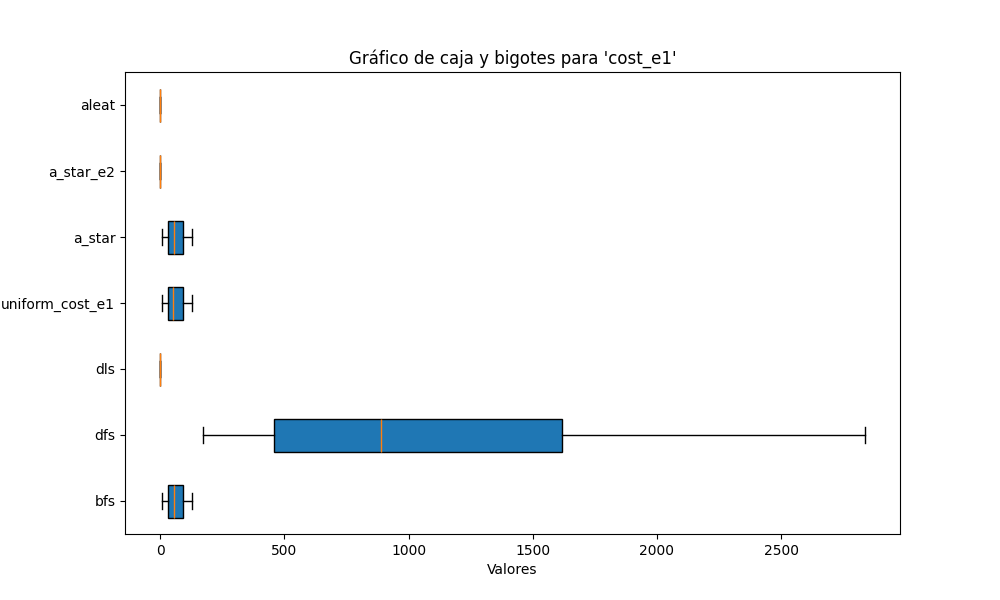

# Reporte  Búsqueda  no informada e informada

## Marco Teórico

### Búsqueda en Inteligencia Artificial
En el campo de la inteligencia artificial, los algoritmos de búsqueda se utilizan para explorar un espacio de estados con el fin de encontrar un camino o una solución a un problema determinado. Existen diferentes enfoques de búsqueda que se dividen principalmente en dos categorías: búsqueda no informada e informada.

- **Búsqueda no informada**: También conocida como búsqueda "a ciegas", es un tipo de búsqueda en la que el algoritmo no tiene conocimiento adicional sobre el espacio de estados más allá de la estructura general del problema. Estos algoritmos exploran el espacio sin una "heurística" o guía adicional sobre cuál es el mejor camino hacia la solución. Ejemplos de algoritmos no informados son BFS, DFS, DLS y UCS.
  
- **Búsqueda informada**: Utiliza información adicional, a través de una heurística, para guiar la búsqueda de forma más eficiente hacia la meta. Un ejemplo común de búsqueda informada es el algoritmo A*, que usa una función de costo combinada para priorizar la exploración de nodos.

### Algoritmos de Búsqueda No Informada

1. **Búsqueda en Anchura (BFS)**: Es un algoritmo que explora el espacio de estados nivel por nivel, avanzando desde el nodo inicial a todos sus nodos hijos antes de profundizar en los siguientes niveles. BFS garantiza encontrar la solución más corta (de menor número de pasos) si todos los costos son iguales, pero puede consumir grandes cantidades de memoria en problemas de gran tamaño debido a su naturaleza expansiva.

2. **Búsqueda en Profundidad (DFS)**: Este algoritmo explora el espacio de estados siguiendo un camino hasta su límite antes de retroceder y explorar otros caminos. DFS es más eficiente en cuanto al uso de memoria en comparación con BFS, pero no garantiza encontrar el camino más corto y puede quedarse atrapado en ciclos o caminos largos sin salida.

3. **Búsqueda en Profundidad Limitada (DLS)**: Es una variante de DFS que impone un límite de profundidad para evitar que el algoritmo explore caminos muy largos o se quede atrapado en ciclos. Esta técnica es útil en problemas con grandes espacios de estados donde la profundidad máxima de la solución es conocida o puede ser aproximada.

4. **Búsqueda de Costo Uniforme (UCS)**: UCS es un algoritmo que prioriza la expansión de nodos basándose en el costo acumulado desde el nodo inicial. A diferencia de BFS, UCS es adecuado cuando los costos de las acciones son desiguales, ya que elige el camino de menor costo acumulado, garantizando así la solución óptima.

### Algoritmos de Búsqueda Informada

1. **Búsqueda A\*: Este algoritmo combina la búsqueda de costo uniforme con una función heurística que estima el costo restante para alcanzar la meta. La función de evaluación de A* se define como \( f(n) = g(n) + h(n) \), donde \( g(n) \) representa el costo del camino desde el nodo inicial hasta el nodo actual \( n \), y \( h(n) \) es la heurística que estima el costo desde \( n \) hasta el objetivo. La heurística ayuda a que el algoritmo explore de manera más efectiva los caminos que probablemente conduzcan a una solución de bajo costo. A* es óptimo y completo si la heurística utilizada es admisible (nunca sobreestima el costo real al objetivo).

### Entorno y Configuración del Experimento

Para probar estos algoritmos, se ha utilizado el entorno **FrozenLake**, un espacio de estados donde un agente debe encontrar un camino seguro hasta su objetivo, evitando caer en agujeros (obstáculos). En este entorno, se evaluaron las configuraciones de costo para cada acción:
   
- **Costo constante**: Cada acción tiene un costo fijo de 1.

## Análisis y Discusión de Resultados

Durante la evaluación de los algoritmos, se recopilaron las medias, medianas y desviaciones estándar de todas las ejecuciones en los 30 escenarios. Estos valores fueron utilizados para generar diagramas de caja y bigotes que permiten visualizar las diferencias entre los algoritmos. Además, se incluyó un gráfico adicional que muestra la frecuencia con la que cada algoritmo encontró una solución en los diferentes entornos evaluados.

### Gráfico de Caja y Bigotes: Costos en el Escenario 1

En este gráfico se puede observar el costo asociado a cada algoritmo en el Escenario 1. Se destaca que el algoritmo DFS presenta los costos más elevados, junto con una gran variabilidad. Para un análisis más detallado, se deben considerar los gráficos individuales de A*, UCS y BFS, ya que estos tres algoritmos muestran un comportamiento más equilibrado. Los otros algoritmos no presentan resultados claros, ya que no fueron capaces de encontrar una solución en la mayoría de los casos, lo que hace que sus costos no sean representativos.

  
  
  

Como se puede ver en estos gráficos, los resultados de A*, UCS y BFS son muy similares. Esto se debe a que los tres algoritmos deben encontrar el mismo camino en el primer escenario, aunque con pequeñas diferencias en la forma en que lo analizan.

### Diagrama de Cajas y Bigotes: Costos en el Escenario 2

En el segundo escenario, se observa un comportamiento similar al de los resultados anteriores. Sin embargo, al analizar más detalladamente, se puede notar una pequeña diferencia entre A* y los otros dos algoritmos con un comportamiento similar.

Para destacar esta diferencia, se presentan los gráficos de cada algoritmo de forma individual.

  
  
  

A partir de estos gráficos, queda claro que A* se destaca de los otros dos algoritmos, mostrando menores costos y una mayor eficiencia, sin mostrar ningún valor atípico.

### Diagrama de Cajas y Bigotes: Tiempos de Ejecución

En cuanto a los tiempos de ejecución, el algoritmo DFS sigue mostrando los peores resultados. Sin embargo, a diferencia de los gráficos anteriores, en este caso todos los algoritmos presentan tiempos de ejecución, ya que aunque algunos no hayan encontrado una solución, su búsqueda aún consume tiempo. Esta métrica permite comparar más detalladamente los tres algoritmos más eficientes: A*, UCS y BFS. En este caso, A* es claramente el algoritmo más rápido, mostrando un rendimiento notablemente superior en comparación con los otros dos.

### Estados Explorados

Finalmente, se analizan los estados explorados por cada algoritmo hasta encontrar una solución. Solo se consideran los algoritmos que produjeron resultados significativos.

  
  
  

En este caso, DFS sigue presentando un rendimiento inferior, con una mediana cercana a los 1000 estados explorados. Los tres algoritmos que demostraron ser eficientes (A*, UCS y BFS) muestran resultados similares en cuanto a los estados explorados, aunque A* tiene una ligera ventaja en eficiencia.

## Conclusión

Tras analizar los diferentes datos obtenidos, se concluye que hay cuatro algoritmos capaces de cumplir con los objetivos establecidos: A*, UCS, BFS y DFS. Sin embargo, DFS muestra un rendimiento inferior en todas las métricas analizadas. Aunque A*, UCS y BFS tuvieron rendimientos muy similares, A* se destacó en las evaluaciones realizadas, especialmente en cuanto a la eficiencia en la exploración de estados y tiempos, lo que hace que las búsquedas informadas sean más efectivas que las no informadas.
