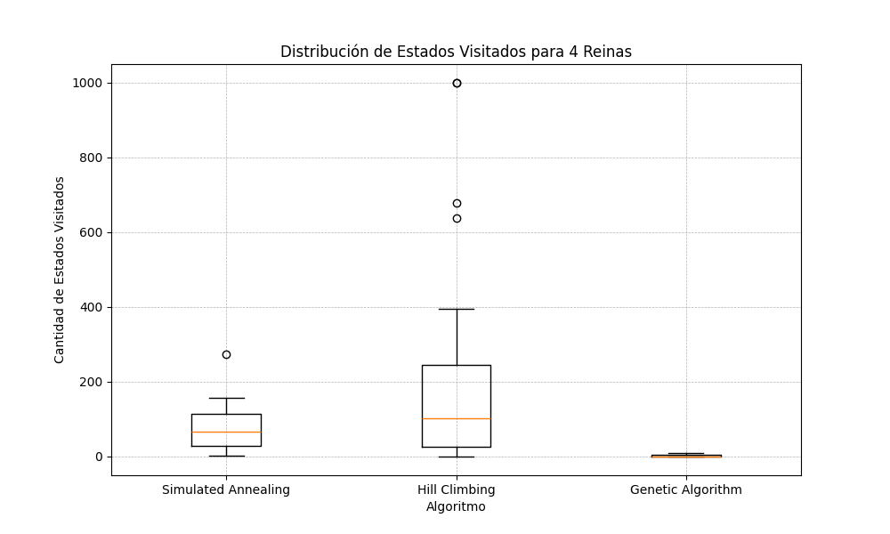
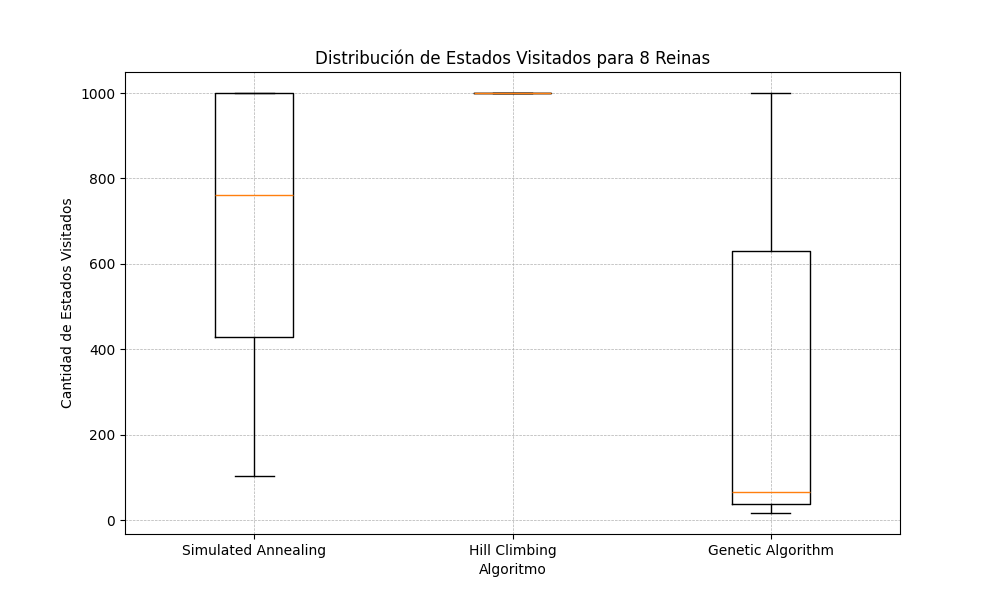
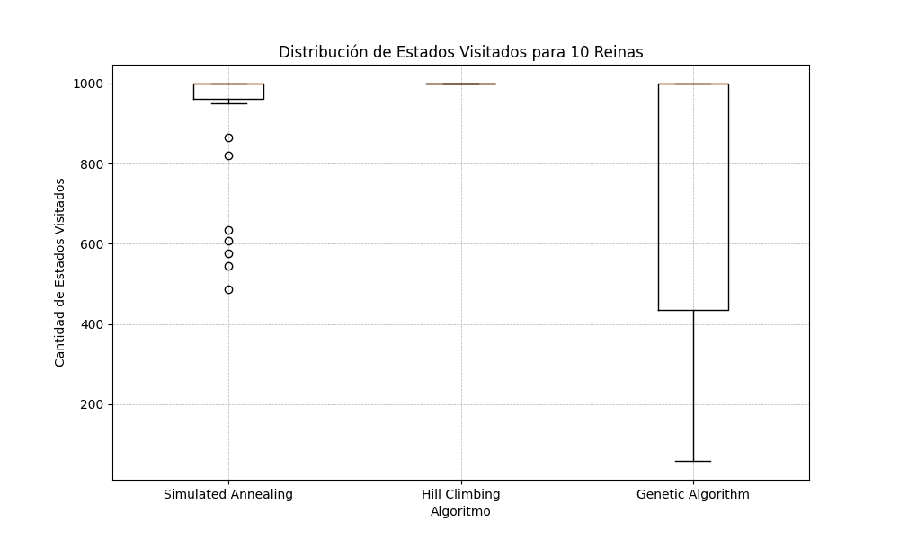
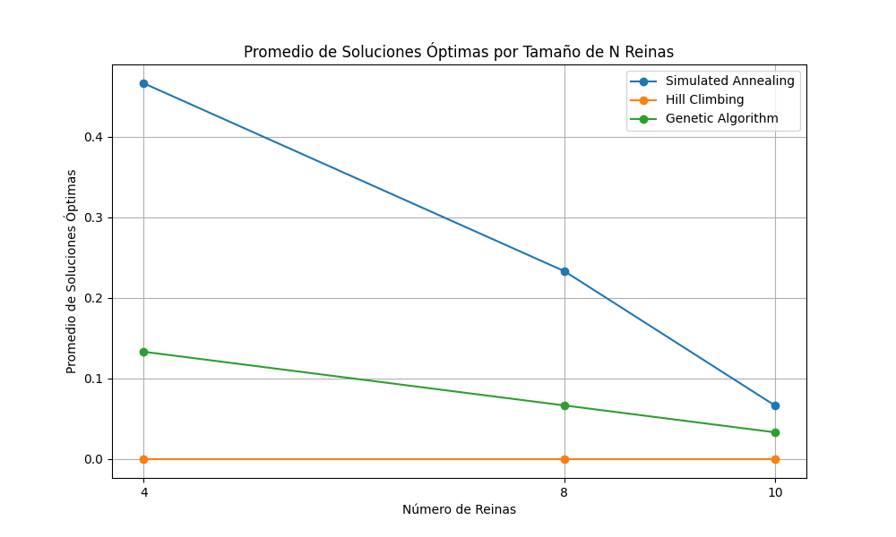
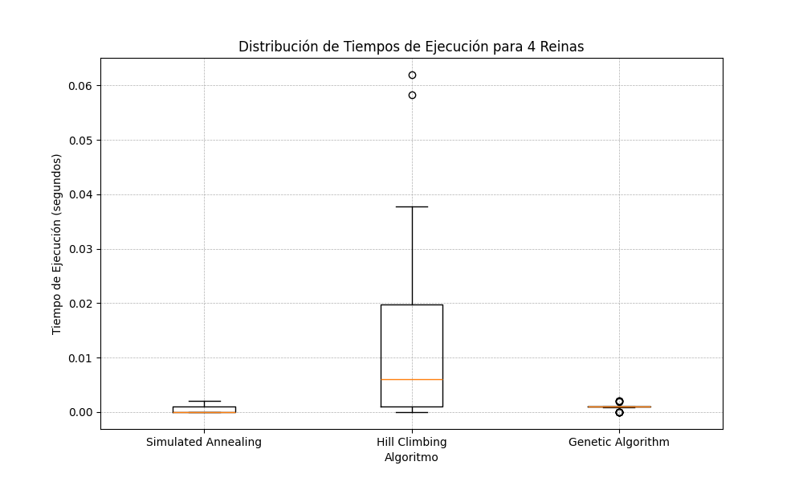
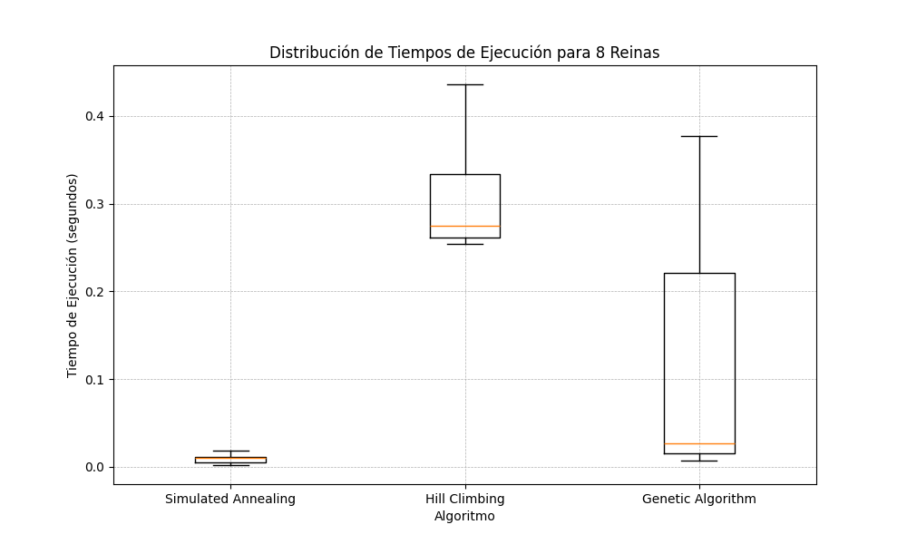
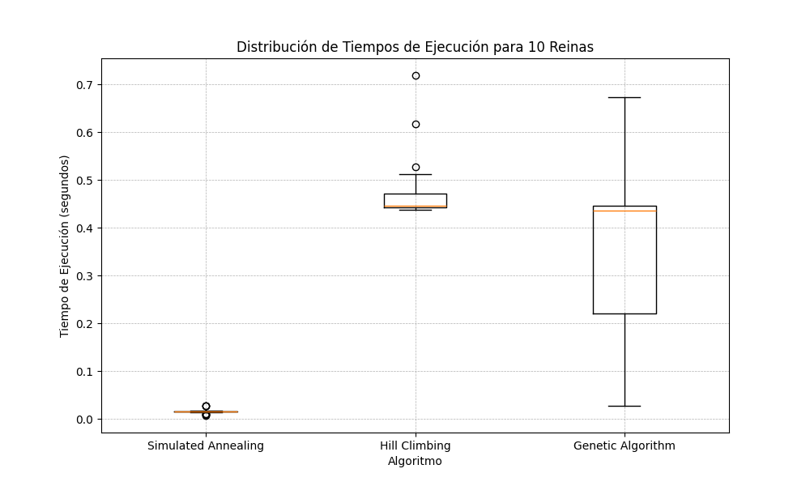
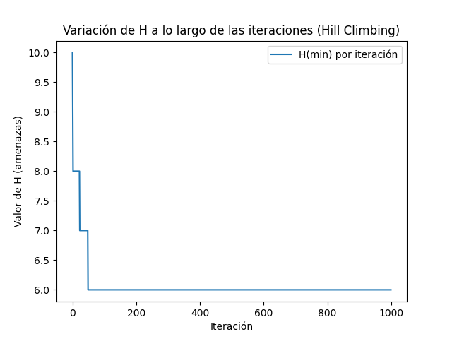
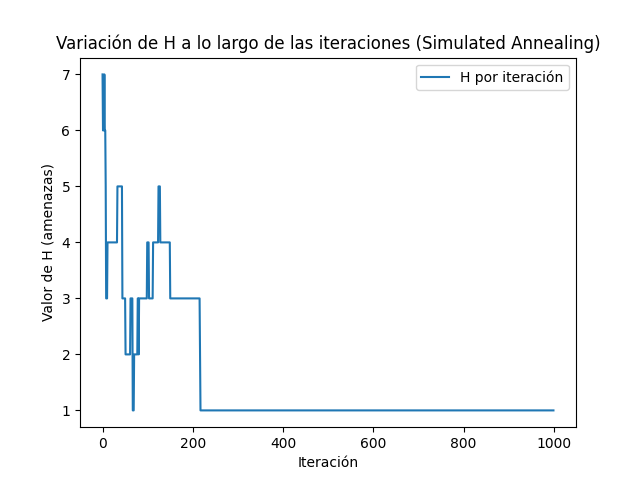
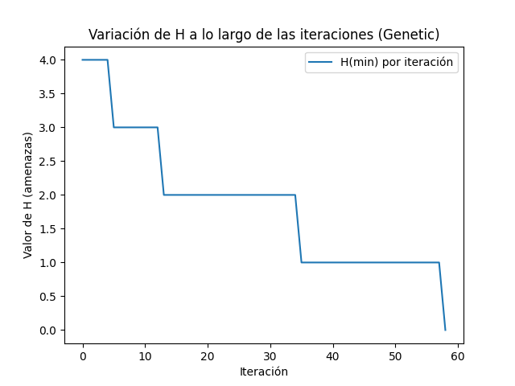

# tp5-reporte.md

## Introducción
En este informe se abordará el problema de las n reinas, donde se busca colocar n reinas en un tablero de ajedrez de n x n de manera que ninguna reina ataque a otra. Este es un clásico problema de optimización que puede ser resuelto mediante diferentes algoritmos de búsqueda local. Se evaluarán tres algoritmos: Simulated Annealing, Hill Climbing y Algoritmo Genético, comparando su desempeño en términos de eficacia y eficiencia.

## Marco teórico
### Simulated Annealing
El Simulated Annealing es un algoritmo de optimización inspirado en el proceso de recocido en metalurgia. Este algoritmo explora el espacio de soluciones de manera probabilística, aceptando incluso soluciones peores para evitar caer en óptimos locales. Su eficacia depende de la temperatura inicial y del mecanismo de enfriamiento.

### Hill Climbing
El algoritmo de Hill Climbing es una técnica de búsqueda local que comienza con una solución inicial y la mejora iterativamente, buscando en los vecinos inmediatos. Acepta solo movimientos que mejoran la solución actual, lo que puede llevar a óptimos locales.

### Algoritmo Genético
El Algoritmo Genético se basa en la teoría de la evolución natural. Utiliza operadores como la selección, el cruce y la mutación para generar nuevas soluciones a partir de una población inicial. Este algoritmo busca explorar el espacio de soluciones de manera más global y puede evitar óptimos locales.

## Diseño experimental
Se realizaron pruebas con los tres algoritmos en tableros de 4, 8 y 10 reinas. Cada algoritmo se ejecutó 30 veces por tamaño de tablero, registrando la cantidad de estados visitados, el tiempo de ejecución y si se alcanzó una solución óptima. Los resultados se guardaron en archivos CSV y se generaron gráficos para la visualización de los datos.

## Análisis y discusión de resultados
A continuación se presentan los resultados obtenidos en los experimentos:

Las gráficas a continuación muestran la distribución de estados visitados y tiempos de ejecución para cada algoritmo:

En las gráficas se observa la distribución de estados visitados por cada algoritmo en los distintos tamaños de problemas. En los dos últimos gráficos, se puede observar que el algoritmo de hill climbing solo presenta valores en la parte superior, lo cual indica que no logra encontrar la solución antes de los 1000 pasos y se detiene únicamente debido a la restricción en la cantidad máxima de pasos permitidos.

En las siguientes gráficas se muestra la evolución del promedio de soluciones óptimas encontradas por los distintos algoritmos. Se observa una clara tendencia a la baja en todos ellos, lo cual se explica al considerar que, al aumentar el tamaño del problema pero mantener fijas las restricciones de pasos, los algoritmos enfrentan mayores dificultades para encontrar soluciones. Además, se nota que el rendimiento del algoritmo de *simulated annealing* disminuye de forma más pronunciada en comparación con el algoritmo genético.

Se podra observar en los siguientes graficos la distribucion de los tiempos de ejecucucion de los algoritmos en los ditintos tamaños. Se puede observar claramente como Simulated Annealing es ampliamente superior en este aspecto para todos los ecenarios exceptuando el primero.

Al analizar la función de ajuste a lo largo de las iteraciones en una ejecución específica para un problema de 10 reinas, se pueden obtener varias conclusiones. 

En el primer algoritmo, se observa que el valor de amenazas se estancó en 6 y no disminuyó antes de alcanzar el límite de mil iteraciones. Para el algoritmo de *Simulated Annealing*, aunque comenzó con pocas amenazas, la reducción fue muy irregular, mostrando varios picos. Esto sugiere que quedó atrapado en un mínimo local y no logró salir de él en las mil iteraciones establecidas. Finalmente, el algoritmo genético mostró un desempeño notable: aunque en la gráfica se muestra el peor individuo de cada generación, los resultados fueron positivos, iniciando con un valor de ajuste bajo y disminuyendo gradualmente hasta encontrar una solución óptima en tan solo 60 iteraciones.

**Análisis breve:** 
- Los resultados indican que el Algoritmo Simulated Annealing tiende a encontrar soluciones óptimas con mayor frecuencia en comparación con los otros algoritmos, especialmente en tableros de mayor tamaño.
- La cantidad de pasos varía significativamente entre los algoritmos, siendo el Genetico el más rápido, aunque con una menor tasa de éxito en la obtención de soluciones óptimas.

## Conclusiones
Los experimentos demostraron que cada algoritmo tiene sus ventajas y desventajas. Mientras que el Simulated Annealing y el Algoritmo Genético son más efectivos en términos de encontrar soluciones óptimas, el Hill Climbing es más rápido pero a menudo se queda atrapado en óptimos locales. En el contexto de problemas como el de las n reinas, es crucial elegir el algoritmo adecuado según el tamaño del tablero y las restricciones del problema. 

