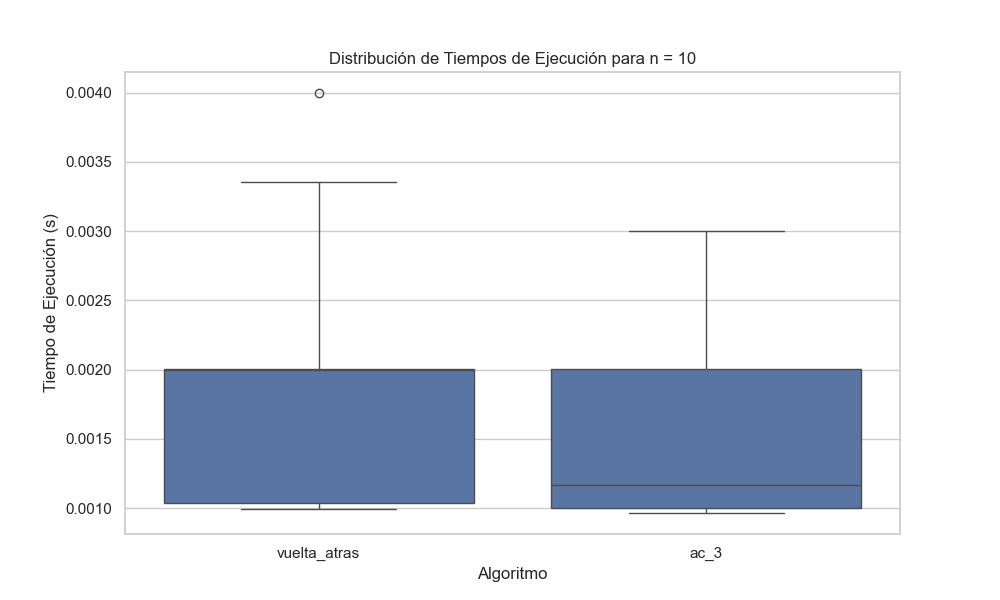
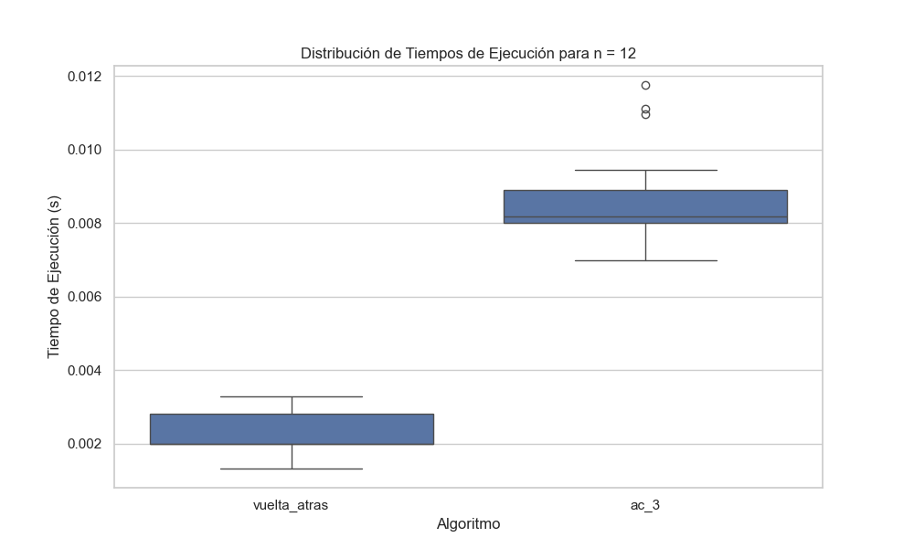
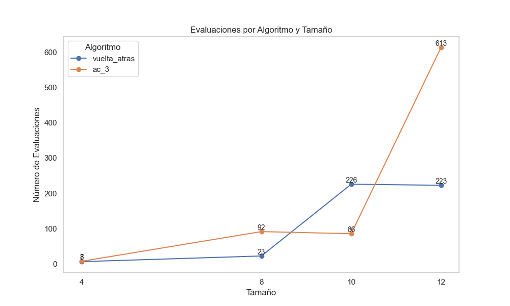

# Trabajo Práctico 6: Satisfacción de restricciones 
### 1) Describir en detalle una formulación CSP para el Sudoku
Para la formulación de CSP para sudoku se debería implementar como variables las distintas casillas, el dominio de posibles valores que podría tener cada variable son números entre el cero al nueve, y cada una debería tener como restricción no tener el mismo valor que alguna variable perteneciente a su columna, fila o a su cuadricula.
### 2) Utilizar el algoritmo AC-3 para demostrar que la arco consistencia puede detectar la inconsistencia de la asignación parcial WA=red, V=blue para el problema de colorear el mapa de Australia.

## Algoritmo

- **Cola inicial**: 
  {(WA, NT), (WA, SA), (NT, WA), (NT, Q), (NT, SA), (SA, WA), (SA, Q), (SA, NT), (Q, NT), (Q, SA), (Q, NSW), (NSW, Q), (NSW, V), (NSW, Q), (V, NSW), (V, SA)}

- **Pasos**:
  1. **Mientras la cola no esté vacía**:
     - Extraer el primer elemento de la cola.
     - Revisar el elemento extraído:
       - Para cada color `x` en el dominio de la variable, si no existe un color `y` en el dominio tal que la restricción entre `X_i` y `X_j` (representada por el arco `(x, y)`) se cumpla, eliminar `x` del dominio.
     - Si se elimina un color del dominio:
       - Si el tamaño del dominio se reduce a 0 (es decir, no hay colores disponibles), el problema es inconsistente y no se puede resolver.
       - Si el tamaño del dominio sigue siendo mayor a 0, agregar los vecinos de `X_i` del elemento actual a la cola para su revisión posterior.

- **Análisis del comportamiento**:
  - En este caso, se revisarán los arcos de la cola sin que se presenten inconsistencias en los primeros pasos. Sin embargo, al llegar a los últimos elementos `(V, NSW)` o `(V, SA)`, se detecta una inconsistencia. A pesar de agregar nuevamente a la cola los vecinos de `V` (es decir, `(NSW, V)` o `(SA, V)`) y reducir el dominio de colores disponibles, no se logra encontrar una solución consistente.
  
  - Por lo tanto, se puede concluir que con la asignación parcial `WA = red, V = blue`, el problema resulta ser inconsistente.

### 3) ¿Cuál es la complejidad en el peor caso cuando se ejecuta AC-3 en un árbol estructurado CSP? (i.e. cuando el grafo de restricciones forma un árbol: cualquiera dos variables están relacionadas por a lo sumo un camino).
En el caso de un árbol estructurado, los arcos no se consideraran más de una vez, por lo que el algoritmo AC-3 tiene complejidad temporal O(ED), donde E es el numero de aristas y D el tamaño del dominio mas grande. 

### 4) AC-3 coloca de nuevo en la cola todo arco (Xk, Xi) cuando cualquier valor es removido del dominio de Xi incluso si cada valor de Xk es consistente con los valores restantes de Xi. Supongamos que por cada arco (Xk, Xi) se puede llevar la cuenta del número de valores restantes de  Xi que sean consistentes con cada valor de Xk. Explicar cómo actualizar ese número de manera  eficiente y demostrar que la arco consistencia puede lograrse en un tiempo total O(n^2d^2).
La idea básica es preprocesar las restricciones de modo que, para cada valor de Xi, realicemos un seguimiento de aquellas variables Xk para las cuales ese valor particular de Xi satisface un arco de Xk a Xi. Esta estructura de datos se puede calcular en un tiempo proporcional al tamaño de la representación del problema. Luego, cuando se elimina un valor de Xi, reducimos en 1 el recuento de valores permitidos para cada arco (Xk, Xi) registrado bajo ese valor.

### 5) Demostrar la correctitud del algoritmo CSP para árboles estructurados (sección 6.5, AIMA 3ra edición). Para ello, demostrar:
#### a) Para un CSP cuyo grafo de restricciones es un árbol, la 2-consistencia (consistencia de arco) implica n−consistencia, siendo n el número total de variables.
#### b) Argumentar por qué lo demostrado en 5a es suficiente.

La **2-consistencia** establece que, dado un par de variables `X_i` y `X_j` conectadas por una restricción, para cada valor en el dominio de `X_i`, debe existir al menos un valor en el dominio de `X_j` que cumpla la restricción entre ambas.

En el contexto de un árbol, la propiedad que debemos tener en cuenta es la ausencia de ciclos. Esto significa que, una vez asignados los valores a las variables, no surgirán "caminos cíclicos" que puedan generar inconsistencias. Así, una vez que una variable cumple con la restricción de su vecino (nodo hijo), esa consistencia se mantendrá intacta incluso si se realizan nuevas asignaciones más adelante.

Para demostrar la **n-consistencia** en un árbol, seleccionamos un nodo "raíz" y procedemos a hacer un recorrido hacia abajo, aplicando la **2-consistencia** en cada nodo. Esto garantiza que, para cualquier valor asignado a una variable, exista al menos un valor compatible en sus nodos hijos. Dado que el grafo no contiene ciclos, no necesitamos preocuparnos de que las asignaciones en otros subárboles interfieran con las consistencias previas. En consecuencia, la **2-consistencia** es suficiente para asegurar la **n-consistencia** en un CSP basado en árboles.

## 7. Ejecutar 30 veces cada uno de los algoritmos implementados en el ejercicio 6, para el caso de 4, 8 y 10 reinas (opcional: 12 y 15 reinas).

# Informe sobre el Desempeño de Algoritmos

Para la demostración de los ejercicios, se optó por realizar gráficos de caja y bigote que muestran los tiempos de ejecución de ambos algoritmos en función de diferentes tamaños, permitiendo así una comparación clara de su desempeño. Además, se analizará la evolución de cada algoritmo a través de los distintos tamaños, considerando la cantidad de estados evaluados.

## Gráficos de Caja y Bigote

Para facilitar la comprensión, se presentarán dos gráficos que representan la eficiencia de los algoritmos para resolver los problemas de las 10 y 12 reinas.

A su vez, se realizará un análisis más profundo mediante la evaluación de un gráfico que muestra la cantidad de evaluaciones por algoritmo y tamaño.

## Conclusiones
Como se puede observar en los distintos gráficos, el algoritmo AC3 muestra un rendimiento similar al del algoritmo de backtracking; en algunos casos es inferior, mientras que en otros es incluso superior. Sin embargo, es evidente que para tamaños mayores, el algoritmo AC3 es ampliamente superado, llegando a triplicar el número de estados evaluados.
